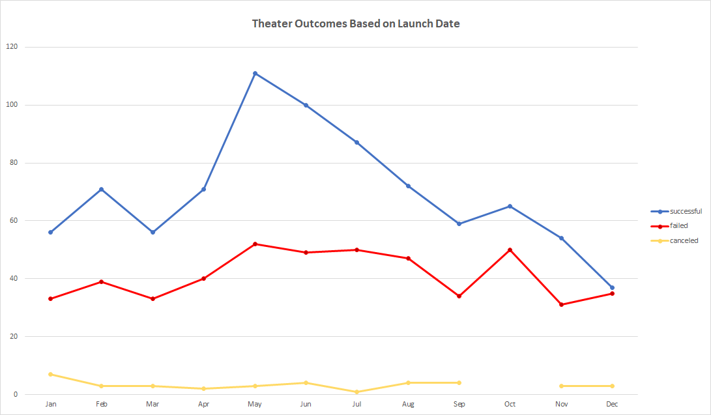
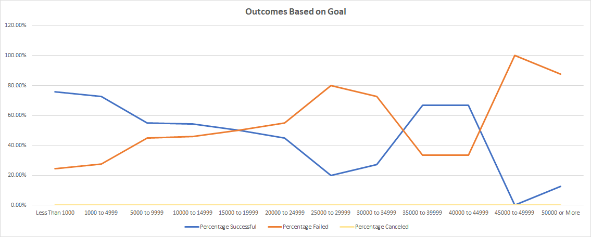

# Kickstarting with Excel

## Overview of Project
This project analyzes kickstarter crowdfunding campaign data for Louise to determine factors and patterns for successful campaigns from 2009 to 2017. We cross-reference the category of the kickstarter with time of year, monetary goal and amount pledged, as well as the average donation for each campaign.
### Purpose
The purpose of this project is to provide Louise with crowdfunding campaign data so she can utilize best practices when launching her campaign, ensuring the liklihood of a successful outcome. The data can determine patterns for successful and unsuccessful campaigns in the same category as Louise's campaign.
## Analysis and Challenges
Our dataset consisted of data from 4115 kickstarter campaigns from 21 different countries between 2009 and 2017. From our analysis, we determined that the time of year and the goal amount all factored in a campaign's outcome. We also improved the provided data by calculating the percentage funded, average donation, breaking down the primary and subcategories into their own columns, as well as calculated the start and end dates of each campaign into M/DD/YYY format from Unix timestamp format.

The Outcomes column was also formated to indicate outcome by color for easy indefying purposes. The "Percent Funded" column was color scaled to assign a color shade to each value, indicating low values with red and gradually changing to blue for higher values.
### Analysis of Outcomes Based on Launch Date

Based on this chart, we can determine the months that yielded the most successful theater campaigns and the months that were more unsuccessful. According to the data, the months of May and June were the most successful time to launch a campaign while successful campaigns began to decline in the Fall and into the Winter months.

The trends between sucessful and failed campaigns somewhat mirror each other, with spikes and dips during similar times of year. We can also determine that cancellations are steady across the year, with a minor jump in January and a small dip in July. 

### Analysis of Outcomes Based on Goals

According to this visualization, we can determine that campaigns had a higher success rate with lower goal amounts. As goal amounts increase, the percentage of failure increases. As campaigns reach the $15,000 to $19,999 range, the percentage of failure surpasses the percentage of successful campaigns. Many playwrights may believe a higher goal amount would yield a successful campaign. However, as the data explains, this is not always the case.
### Challenges and Difficulties Encountered
Some challenges and difficulties encountered involved broadening the data. As we reviewed the initial dataset, we needed to expand and calculate averages and percentages to get a better idea on successful and unsucessful campagins.

After calculating the "Percentage Funded" column, we were left with several outliers that skewed our data. These outliers require further investigation to determine if they were entered incorrectly or consist of data integrity issues.

The date columns were also provided in Unix timestamps, which needed to be converted to understand the start and end dates of campaigns.

## Results

Our two conclusions for Louise are to launch her campaign in the early Summer, specifically in the months of May or June. We also recommend that Louise avoid launching her campaign in October-December, as failure rate is high and sucessful campaigns are at a low point.

We recommend Louise decrease her campaign goal from above $10,000 to below $5,000 if possible. Although her budget still falls under the percentage successful for outcomes based on goals, she is getting near the successful/failed intersecting point. While a recuded budget would increase the likelihood of success.

Limitations with the dataset include several outliers that prevent accurate depiction of our conditional formatting for the "Percent Funded" column. The data range is also several years old. Trends and patterns may have changed since the data was collected. If Louise launches her campaign in the near future, there may be slight adjustments on outcomes based on launch date and goal.

Other possible ways we could view the data to better understand the likelihood of successful and unsuccessful campaigns is to compare the outcomes based on country. Some categories may be more successful in specific countries based on culture and interests. We may also want to graph the outcomes based on duration of the campaign. Do longer campaigns tend to be more successful? Are radio & podcast campaigns more popular in one country versus video games? These are all questions we can answer with further analysis.
 